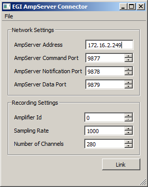

# Usage

This program should work with any amplifier that works with the AmpServer produced by EGI (http://www.egi.com/).
Note: This program is currently untested since we don't have physical access to a NetAmp. If you experience issues while trying to use it, please let us know so we can take a look at the problem and debug it if necessary.

  * Make sure that your AmpServer is running and can correctly record from its connected amplifier(s). To connect to the Amp Server you need to purchase the Amp Server Pro SDK, see: [ftp://ftp.egi.com/pub/documentation/placards/AS_guide_8409503-50_20100421.pdf](ftp://ftp.egi.com/pub/documentation/placards/AS_guide_8409503-50_20100421.pdf), otherwise the LSL application will not work.

  * Start the EGIAmpServer app. You should see a window like the following.
> > 

  * Make sure that you have the correct IP address of the AmpServer assigned. The ports correspond to the default settings of the server and should not require a change.

  * If you have multiple amplifiers connected to the AmpServer and you would like to record from a specific one, you need to set the correct amplifier ID (these should be increasing from zero). Also make sure that you are using a supported number of channels and a supported sampling rate (the defaults should work).

  * To link the application to the LSL, click the "Link" button. If all goes well you should now have a new stream on the network with name "EGI NetAmp k" (k corresponding to the index of the amplifier) and type "EEG". If you get an error you might try to manually power on the desired Amp and try to link while it is either recording or stopped.

  * For subsequent uses you can save the desired settings from the GUI via File / Save Configuration. If the app is frequently used with different settings you might make a shortcut on the desktop that points to the app and appends to the Target field of the shortcut the snippet `-c name_of_config.cfg` to denote the name of the config file that should be loaded at startup.

# Acknowledgements
This application was written to behave near-identically to the BCI2000 AmpServer module that was originally created by EGI.

# Optional

The configuration settings can be saved to a .cfg file (see File / Save Configuration) and
subsequently loaded from such a file (via File / Load Configuration).

Importantly, the program can be started with a command-line argument of the form
`EGIAmpServer.exe myconfig.cfg`, which allows to load the config automatically at start-up.
The recommended procedure to use the app in production experiments is to make a shortcut on
the experimenter's desktop which points to a previously saved configuration customized to the
study being recorded to minimize the chance of operator error.
